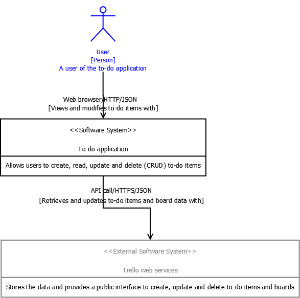
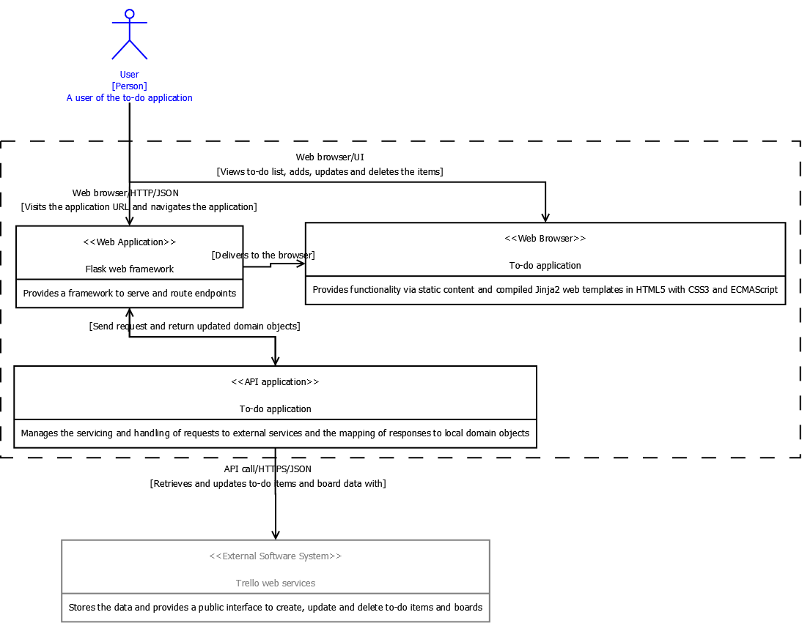
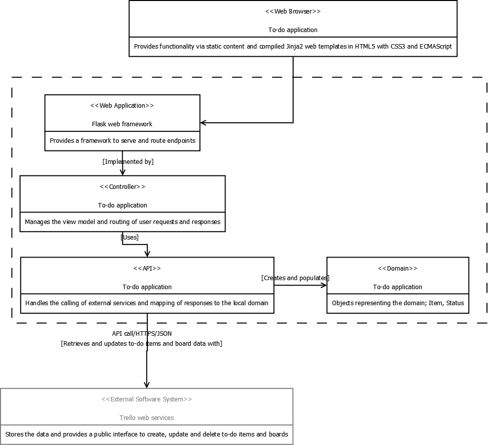
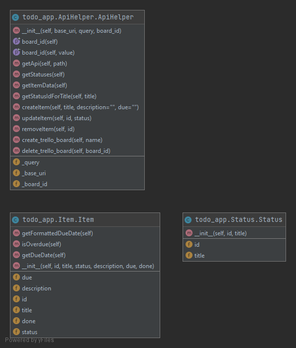

# DevOps Apprenticeship: Project Exercise

## Getting started

### Environment variables

This application can run via API or database. The `ApiHelper` is configured to support the Trello API whilst the `DatabaseHelper` supports MongoDB from Atlas.

**The application default is database.**

To run effectively, copy the `.env.template` file and rename to `.env`. Update the `.env` file with your application details,

For API based application:

1. `API_KEY` - Used to call the [Trello](https://developer.atlassian.com/cloud/trello/rest/api-group-actions/) API
2. `API_TOKEN` - Used to call the [Trello](https://developer.atlassian.com/cloud/trello/rest/api-group-actions/) API
3. `BOARD_ID` - An ID reference to the [board](https://developer.atlassian.com/cloud/trello/rest/api-group-boards/#api-boards-id-get) on Trello

For database based application:

1. `DATABASE_URL` - URL to your database
1. `DATABASE_NAME` - Name of your database

To switch to use API call the appropriate Helper class in `app.py`. As a future enhancement the Ryan's Todo app team may add an envvar which will allow the user to declare whether to run the application with API or database, e.g. `TYPE=API` or `TYPE=DB`, defaulting to `DB` if incorrect value added. This can also provide a backup source if a system is down.

### Run

This application requires a collection to be available named `statuses` with three records:

1. `{"_id":{"$oid":"60705b11cfc3999b2e0da2b8"},"name":"To Do"}`
2. `{"_id":{"$oid":"60705b71cfc3999b2e0da2b9"},"name":"Doing"}`
3. `{"_id":{"$oid":"60705b79cfc3999b2e0da2ba"},"name":"Done"}`

Once the setup script has completed and all packages have been installed, start the Flask app by running:
```bash
$ flask run
```

You should see output similar to the following:

```bash
 * Serving Flask app "app" (lazy loading)
 * Environment: development
 * Debug mode: on
 * Running on http://127.0.0.1:5000/ (Press CTRL+C to quit)
 * Restarting with fsevents reloader
 * Debugger is active!
 * Debugger PIN: 226-556-590
```

Now visit [`http://localhost:5000/`](http://localhost:5000/) in your web browser to view the app.

### Testing

#### Unit testing

To run unit tests use the command:

```bash
$ pytest todo_app\tests\
```

#### Integration testing

Tests are also available in Chrome. You will need Chrome version 90.

To run Chrome tests use the command:

```bash
$ pytest todo_app\tests_e2e\
```

The Chrome tests run in headless mode and are used when building with Docker.

#### Statuses

This application relies on the existence of Lists on the Trello board named "`To Do`", "`Doing`", and "`Done`" (the default set). The code is extendable to use further lists by calling `statuses` directly from the `ViewModel` rather than the `board_statuses` subset (the default set) returned by `getBoardStatuses`. "`Done`" is still required to facilitate the `/complete/<id>` route. An alternative solution for this would be to simply set the "complete" item with the _last_ status in the list of statuses returned from Trello, e.g. `item['status'] = getStatuses()[-1].title`. Another solution would be to remove the route as the functionality to mark a task as "complete" is fulfilled by the drag and drop feature.

### Virtual environments

This application can also be run within a virtual machine (VM) by using [Vagrant](https://www.vagrantup.com/downloads.html).

Vagrant requires a hypervisor installed. This application is configured to use any provider. The following set up details running the Vagrant with Windows [Hyper-V](https://docs.microsoft.com/en-us/virtualization/hyper-v-on-windows/about/). 

#### Setting up Hyper-V

1. Install Hyper-V
2. Add an external switch in Hyper-V Manager as per "Tip 1" in these [instructions](https://techcommunity.microsoft.com/t5/virtualization/vagrant-and-hyper-v-tips-and-tricks/ba-p/382373).
3. Virtualization may need to be turned on in the firmware. To check perform one of the following:
   - Via Control Panel -> Performance -> CPU -> Virtualisation: enabled
   - In Command Prompt run `systeminfo`, note the Hyper-V Requirements . You will see a "No" for `Virtualization Enabled In Firmware` if it is off
   - In PowerShell run `Get-ComputerInfo -property "HyperV*"`, note the `HyperVisorPresent` boolean value
4. If virtualization needs turning on, this must be done via the BIOS. This varies by machine but generally the steps are:
   1. Restart the system
   2. Press F2 (or alternate shown on screen) to enter BIOS
   3. Navigate to Advanced
   4. Select Virtualization Technology and then press the Enter key and select Enabled
   5. Escape and save

#### Run the application on the VM

To run the VM, run the following command as an admin:

`vagrant up`

You'll be asked to choose a switch to attach to the Hyper-V instance. Select the external switch created during the Hyper-V setup.

The machine will now report it's IP address. Take note of this as it will be used to access the application later.

The command may request your username and password. Enter your Windows credentials (the `@domain` is optional).

The Vagrantfile within this repo will:

- Pull down a Ubuntu Linux image to run the app
- Prep your VM for Python installation
- Install Python 3.6.6
- Install poetry and load any dependencies
- Launch the TODO app
  
Add the IP of the VM to your browser with the port of `5000` to see the TODO application.

##### Example output

````
→ vagrant up
Bringing machine 'default' up with 'hyperv' provider...
==> default: Verifying Hyper-V is enabled...
==> default: Verifying Hyper-V is accessible...
==> default: Importing a Hyper-V instance
    default: Creating and registering the VM...
    default: Successfully imported VM
    default: Please choose a switch to attach to your Hyper-V instance.
    default: If none of these are appropriate, please open the Hyper-V manager
    default: to create a new virtual switch.
    default:
    default: 1) External Switch
    default: 2) Default Switch
    default:
    default: What switch would you like to use? 1
    default: Configuring the VM...
    default: Setting VM Enhanced session transport type to disabled/default (VMBus)
==> default: Starting the machine...
==> default: Waiting for the machine to report its IP address...
    default: Timeout: 120 seconds
    default: IP: 123.456.0.78
==> default: Waiting for machine to boot. This may take a few minutes...
    default: SSH address: 123.456.0.78:26
    default: SSH username: vagrant
    default: SSH auth method: password
    default:
    default: Inserting generated public key within guest...
    default: Removing insecure key from the guest if it's present...
    default: Key inserted! Disconnecting and reconnecting using new SSH key...
==> default: Machine booted and ready!
==> default: Preparing SMB shared folders...
    default: You will be asked for the username and password to use for the SMB
    default: folders shortly. Please use the proper username/password of your
    default: account.
    default:
    default: Username (user[@domain]): Ryan
    default: Password (will be hidden):

Vagrant requires administrator access to create SMB shares and
may request access to complete setup of configured shares.
==> default: Mounting SMB shared folders...
    default: C:/projects/DevOps-Course-Starter => /vagrant
==> default: Running provisioner: shell...
    default: Running: inline script
	... install prereqs
	... install pyenv
	... install python
	... install poetry
==> default: Running action triggers after up ...
==> default: Running trigger: Launching App...
==> default: Running the TODO application setup script
    default: Running: inline script
    default: Creating virtualenv todo-app-vs8V2ZPt-py3.6 in /home/vagrant/.cache/pypoetry/virtualenvs
    ... install dependencies via poetry
    default:  * Serving Flask app "app" (lazy loading)
    default:  * Environment: development
    default:  * Debug mode: on
    default:  * Running on http://0.0.0.0:5000/ (Press CTRL+C to quit)
    default:  * Restarting with stat
    default:  * Debugger is active!
    default:  * Debugger PIN: 110-403-136
````

### Containers

The application can run with Docker.

#### Development

1. Create a docker image with name and tag targetted for `dev`: 
   - `docker build --target dev -t todo-app:dev .`
2. Start the container with `docker-compose` 
   - `docker-compose up -d`
3. The application will now be available in [localhost with port 5000](http://localhost:5000)

#### Production

1. Create a docker image with name and tag targetted for `prod`: 
   - `docker build --target prod -t todo-app:prod .`
2. Run the container with specified `.env` file and assigned the port: 
   - `docker run --env-file .env -p 8000:8000 todo-app:prod`
3. The application will now be available in [localhost with port 8000](http://localhost:8000)

#### Test

1. Create a docker image with name and tag targetted for `test`: 
   - `docker build --target test -t todo-app:test .`
2. Run the container with the unit, integration or the headless browser tests
   - `docker run todo-app:test todo_app/tests` - unit and integration
   - `docker run --env-file .env todo-app:test todo_app/tests_e2e/chrome_test.py` - web unit tests

## Architecture

The following diagrams help describe the structure of the application and it's external components.

### Context

The To-do application has two external actors; the User and the Trello web services.



### Container

The To-do application container can be split between the Flask web framework, the web browser and the API application.



### Component

The components within the To-do application.



### Code

This diagram was generated by [PyCharm](https://www.jetbrains.com/pycharm/). 

